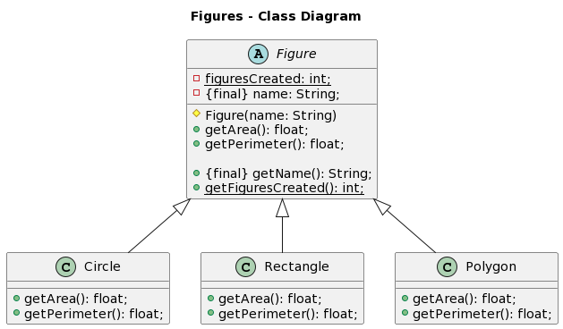

# Figures Diagram
> This is the diagram.

> This is the plantuml

>@startuml
>
>title Figures - Class Diagram
>
> 
>abstract class Figure{
> 
>-{static} figuresCreated: int;
> 
>-{final} name: String;
>
>#Figure(name: String)
>+getArea(): float;
> 
>+getPerimeter(): float;
>
>+{final} getName(): String;
> 
>+{static} getFiguresCreated(): int;
> 
>}
>
>+class Circle extends Figure{
>
>+getArea(): float;
> 
>+getPerimeter(): float;
> 
>}
>
>+class Rectangle extends Figure{
>
>+getArea(): float;
> 
>+getPerimeter(): float;
> 
>}
>
>+class Polygon extends Figure{
>
>+getArea(): float;
> 
>+getPerimeter(): float;
> 
>}
>
>@enduml